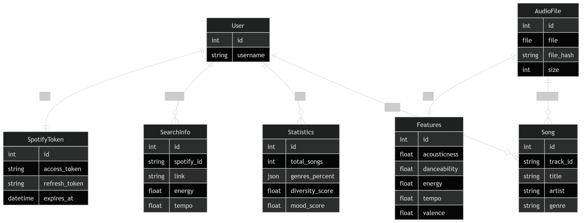
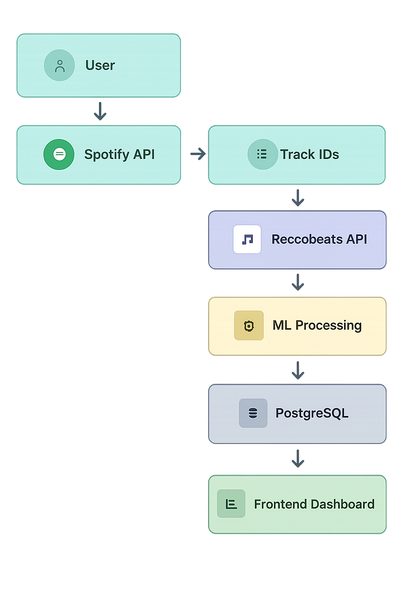
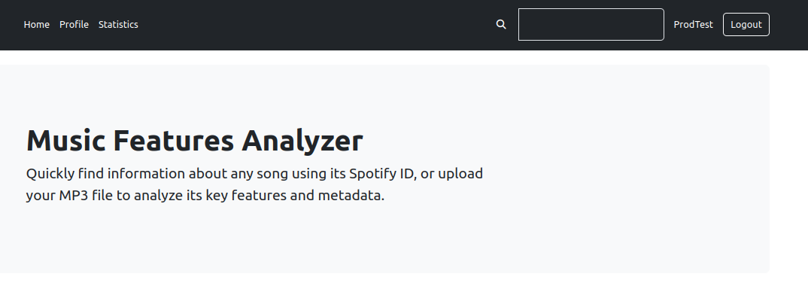
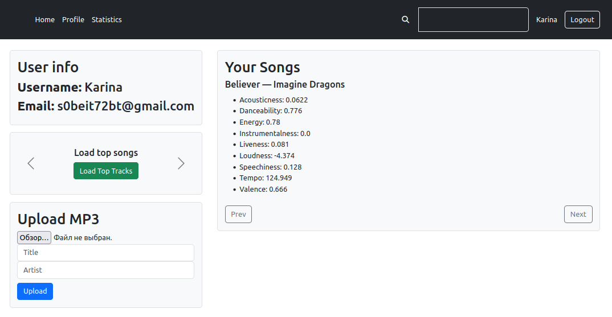
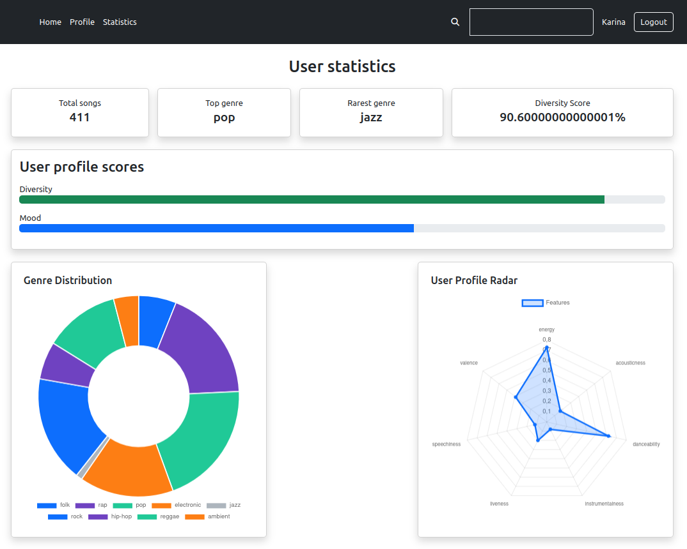
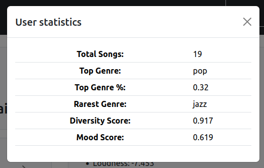
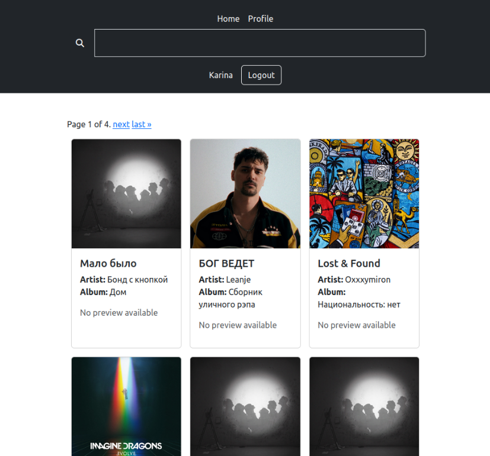

# 🎧 Music Features Analysis  
---

## About

Music Features Analysis is a web application that analyzes Spotify listening data and uploaded audio files to generate detailed music insights. It integrates Spotify and Reccobeats APIs to extract track features, applies machine learning for genre and mood detection, and provides users with advanced analytics such as taste profiles, playlist diversity, and listening patterns.

---

## Key Features

### 1. Authentication & User Management
- User registration and login system
- Secure authentication via Spotify OAuth 2.0
- Persistent user sessions
- Token storage and refresh handling

### 2. Spotify Profile Integration
- Fetching user data from Spotify API:
    - Profile information,
    - Top tracks,
    - Listening history
- Automatic synchronization with user account
- Handling API pagination and rate limits

### 3. Audio Data Ingestion
-	Upload and analysis of local MP3 files 
-	Import of tracks from Spotify profile 
-	Unified pipeline for processing both sources 


### 4. Multi-API Integration
-	Spotify API → track metadata 
-	Reccobeats API → audio features extraction (Example audio features):
  ````
  {
    "acousticness": 0,
    "danceability": 0,
    "energy": 0,
    "instrumentalness": 0,
    "liveness": 0,
    "loudness": 0,
    "speechiness": 0,
    "tempo": 0,
    "valence": 0
  }
  ````
---
### 5. Machine Learning Pipeline
-	Feature-based analysis of tracks 
-	Genre classification 
-	Mood detection 
-	Aggregation of user listening features/genres 

ML Outputs:
-	track genre 
-	track mood 
-	user playlist diversity

### 6. Advanced Music Analytics
- User-level insights:
    - Taste profile (average features)
    - Dominant genres
    - Listening preferences 
- Playlist-level analytics:
  - Playlist diversity
  - Mood distribution
  - Feature distribution (energy, valence, etc.) 

### 7. Data Storage & Architecture
-	PostgreSQL scheme: 

-	Redis for caching API responses

### 9. Interactive Dashboard
-	User profile overview 
-	Track analytics visualization 
-	Taste profile display 
-	Playlist insights

### 10. Data processing Pipeline


---

## 🧩 Tech Stack

- Python, Django
- PostgreSQL, redis
- Spotify Web API
- Spotipy / requests
- dotenv
- cryptography
- pandas
- numpy
- HTML, CSS
- Bootstrap
- JavaScript

---

## 📁 Project Structure
```
Music-Features-Analysis/
│
├── manage.py
├── config/
├── mainapp/
│   │
│   ├── views/
│   ├── services/
│   ├── utils/
│   ├── templates/
│   │   └── mainapp/
│   ├── static/
│   └── migrations/
│
├── media/
│   └── audio/
│
└── PostgreSQL
```

---

## Spotify API Integration

Endpoints used:
- /v1/me
- /v1/me/top/tracks
- /v1/me/player/recently-played

## 🔑 Scopes Spotify API
```
SPOTIFY_SCOPES = [
    "user-read-email",
    "user-read-private",
    "user-top-read",
    "playlist-modify-public",
    "playlist-modify-private",
]
```

---

## ReccoBeatsAPI Integration

Endpoints used:
- /v1
- track/{song_id}/audio-features
- v1/track?ids={id}

---

## 📡 Endpoints
```
/
/signin/
/login/
/logout/
/upload/
/search/
/search_ajax/
/profile/
/profile/top_songs/
/profile/stats/
/login/spotify/
/callback/spotify/
/load_analizer_info/
```

---

## 🖼️ Screenshots







---

## ⚙️ Installation

```bash
git clone https://github.com/Enmadnessgine/Music-Features-Analysis
cd Music-Features-Analysis
python -m venv env
env\Scripts\activate
pip install -r requirements.txt
```

Create .env:

SPOTIFY_CLIENT_ID=your_id  
SPOTIFY_CLIENT_SECRET=your_secret  
SPOTIFY_REDIRECT_URI=http://127.0.0.1:8000/callback/spotify/  

Run:

```bash
python manage.py migrate
python manage.py runserver
```

---

## 👤 Authors

- https://github.com/Enmadnessgine
- https://github.com/HoleGod
- https://github.com/MaksymMaryniuk
